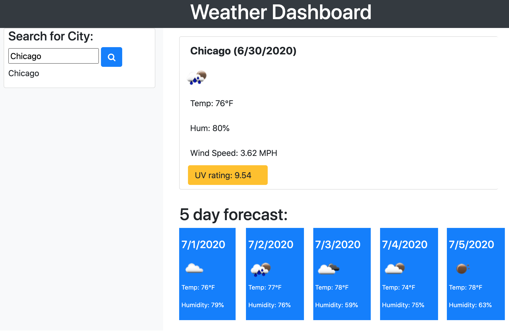

# Weather Dashboard
I am using API calls to popluate a weather dashboard for different cities using openweather. 

## User Story
When a user arrives to the page, the user will see any previosuly stored information populated from local storage. For example, if the user previously searched for Chicago, that city would display on the left hand sidebar and be placed into the search input to render that data automatically for the user. 

* UV data with dyanmically rendered color badge to show danger (red) for UV over 10. 
* Forecast for 5 days
* Openweather icon pictures for more visual weather data

## Code Strategy
I used Bootstrap for the frontend CSS framework and used their card system embedded with the grid layout. In addition, I used JQuery to target classes and to set data attributes. This also helped store data in to local storage. 

Most important for my learning journey, I used ajax APU calls for the first time!

A few key code snippets that helped to do some heavy lifting:

```
$.ajax({
            url: queryURLforecast,
            method: "GET"
        }).then(function (response) {
```

This allowed me to get significant amounts of weather data and present the cards using bootstrap to the user. 

### Link to deployed Weather Dashboard Scheduler
[Weather-Dashboard](https://crackedsnowboard.github.io/weather-dashboard/)

#### Image of Deployed Web Applicaton


###### Author Links
[LinkedIn](linkedin.com/in/joel-mathen/)
[GitHub](https://github.com/crackedsnowboard)
